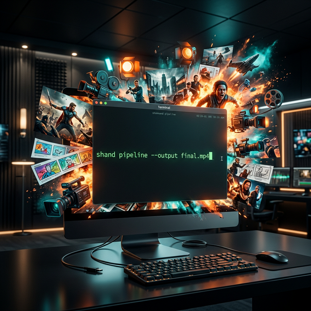

# StagentHand (`shand`)



[](https://go.dev)
[](LICENSE)

[English](./README.md)

> **CLI-first AI 短劇製作 Pipeline — 全自動、專為 Agent 設計的產線。**

---

## 管線流程

```
Story Prompt
  ↓ story-to-outline       (LLM)
Outline JSON
  ↓ outline-to-storyboard  (LLM)
Storyboard JSON
  ↓ storyboard-to-panels   (LLM)
Panel[] JSON
  ↓ panels-to-images       (Nano Banana 2 / Nova Canvas, concurrent)
Panel[] + image_url
  ↓ TTS                    (Amazon Polly Neural + SSML)
Panel[] + audio_url
  ↓ BGM                    (Jamendo API)
  ↓ storyboard-to-remotion-props
RemotionProps JSON
  ↓ remotion-render        (npx remotion)
output.mp4
  ↓ critic                 (Amazon Nova Pro, multimodal)
APPROVE / REJECT
```

---

## 功能特色

### 核心管線

從一句故事描述直接產出 MP4。每個階段以 JSON 從 stdin 讀取、stdout 輸出，可任意與 Unix 工具組合。

### LLM 支援

三個提供商開箱即用，優先順序：flag > 環境變數 > config 檔 > 預設值。

| 提供商 | 設定值 |
|---|---|
| AWS Bedrock (Claude / Nova) | `llm.provider: bedrock` |
| OpenAI 相容（Gemini、本地端） | `llm.provider: openai` 或 `gemini` |
| Google Gemini | `llm.provider: gemini` |

### 圖像生成

兩個圖像提供商。Nano Banana 2 支援角色參考圖保持跨鏡頭一致性；Nova Canvas 為 AWS Bedrock 選項。

| 提供商 | 設定值 |
|---|---|
| Nano Banana 2（基於 Gemini） | `image.provider: nanobanana` |
| AWS Nova Canvas | `image.provider: nova` |

### 語音合成

Amazon Polly Neural（Zhiyu 中文語音）。對白自動包裝成 SSML；偵測 `Whisper:` 標記並轉為 Polly 悄聲效果；語速鎖定 90% 避免急促感。

### 背景音樂

整合 Jamendo API，由 `BGMTags` directive 驅動（如 `cinematic+dark`）。自動搜索、選取第一首並下載 MP3。

### AI 評審

使用 Amazon Nova Pro 多模態模型對渲染後的 MP4 進行評審。4 個維度評分，強制閾值：視覺 ≥ 8、音視頻同步 ≥ 8、總分 ≥ 32/40。

| 維度 | 說明 |
|---|---|
| 視覺一致性 (A) | 角色一致性、字幕清晰度 |
| 音視頻同步 (B) | BGM 閃避、語音自然度、字幕時序 |
| Directive 遵循度 (C) | BGM 情境匹配、視覺 directive 合規性 |
| 敘事基調 (D) | 節奏感、戲劇呼吸空間、故事收尾 |

### Directives 配置系統

兩個全域 directive 透過 JSON 注入：

- `style_prompt`：自動前置到每個 panel 的圖像生成 prompt，確保視覺風格統一。
- `bgm_tags`：傳給 Jamendo 控制音樂情境。

另有 per-panel `PanelDirective`，可控制鏡頭動效、轉場類型、字幕位置與字體大小。

### 智能恢復機制

檔案感知快取。管線中途失敗後重啟，自動跳過磁碟上已存在的 `image_url` / `audio_url` 資產。不重複呼叫 API，不浪費費用。

### 人類監控

四個 HITL 檢查點：`outline`、`storyboard`、`images`、`final`。三種審核管道都寫入同一個 SQLite 記錄。

```
story → [outline ⏸] → [storyboard ⏸] → [images ⏸] → [final ⏸] → mp4
```

| 管道 | 操作方式 |
|---|---|
| CLI | `shand checkpoint approve <id>` |
| Discord | Webhook → bot 回覆 |
| HTTP API | `POST :28080/checkpoints/:id/approve` |

### Agent 友好設計

以 AI Agent 為第一優先使用者。嚴格的輸入防護阻擋目錄穿越、雙重編碼與控制字元注入。非零 exit code 加上結構化 stderr 讓 Agent 可預測地進行 retry。

---

## 快速開始

### 環境需求

```bash
# Go 1.23+, Node.js 20+, FFmpeg, AWS CLI
brew install awscli ffmpeg node
go build -o shand .
```

### 全流程執行

```bash
echo "機器人找到了一朵會發光的花" | ./shand pipeline --skip-hitl
```

### 從現有 panels 恢復

```bash
cat ~/.shand/projects/my-id/remotion_props.json | ./shand pipeline --skip-hitl
```

### 只執行渲染

```bash
cat remotion_props.json | ./shand remotion-render --output ./final.mp4
```

### 執行 AI 評審

```bash
./shand critic --video ./final.mp4 --props ./remotion_props.json
```

---

## 配置

預設配置路徑：`~/.shand/config.yaml`。環境變數使用 `SHAND_` 前綴（如 `SHAND_LLM_API_KEY`）。CLI flag 優先級最高。

```yaml
llm:
  provider: bedrock          # bedrock | openai | gemini
  model: amazon.nova-pro-v1:0
  aws_access_key_id: ""
  aws_secret_access_key: ""
  aws_region: us-east-1
  # For openai/gemini:
  # api_key: ${GOOGLE_API_KEY}
  # base_url: ""             # Leave empty for default; any OpenAI-compatible URL works

image:
  provider: nanobanana        # nanobanana | nova
  api_key: ${GOOGLE_API_KEY}
  width: 1024
  height: 576
  # For nova (AWS Bedrock):
  # provider: nova
  # access_key_id: ""
  # secret_key: ""
  # region: us-east-1

audio:
  voice_provider: polly       # polly (default)
  music_provider: jamendo     # jamendo (default)
  jamendo_client_id: ""       # Leave empty to use public test key

remotion:
  template_path: ./remotion-template
  composition: ShortDrama

notify:
  discord_webhook: ${DISCORD_WEBHOOK_URL}

store:
  db_path: ~/.shand/shand.db

server:
  port: 28080                 # HTTP API for agent / Discord bot checkpoint approval
```

---

## 指令參考

所有指令從 stdin 讀取 JSON，輸出到 stdout（另有說明除外）。所有指令支援 `--dry-run` 驗證，不呼叫外部 API。

| 指令 | 說明 |
|---|---|
| `shand pipeline` | 全流程：故事 → mp4 |
| `shand story-to-outline` | 故事描述 → 大綱 JSON |
| `shand outline-to-storyboard` | 大綱 → 分鏡腳本 |
| `shand storyboard-to-panels` | 分鏡腳本 → 畫格列表 |
| `shand panel-to-image` | 生成單一畫格圖像 |
| `shand panels-to-images` | 批量並發圖像生成 |
| `shand storyboard-to-remotion-props` | 畫格列表 → Remotion 配置 |
| `shand remotion-render` | 渲染 MP4 |
| `shand remotion-preview` | 開啟 Remotion Studio 預覽 |
| `shand critic` | AI 多模態視頻品質評審 |
| `shand checkpoint list` | 列出所有 HITL 檢查點 |
| `shand checkpoint approve <id>` | 批准檢查點 |
| `shand checkpoint reject <id>` | 拒絕檢查點 |
| `shand checkpoint wait <id>` | 輪詢直到檢查點完成 |
| `shand status <job-id>` | 查詢任務狀態 |

### 常用 flags

| Flag | 適用指令 | 效果 |
|---|---|---|
| `--dry-run` | 所有指令 | 跳過外部 API 呼叫，回傳模擬 JSON |
| `--skip-hitl` | `pipeline` | 停用全部 4 個 HITL 暫停點 |
| `--output <path>` | `remotion-render` | 輸出 MP4 路徑 |
| `--video <path>` | `critic` | 渲染後 MP4 的路徑 |
| `--props <path>` | `critic` | `remotion_props.json` 的路徑 |
| `--config <path>` | 所有指令 | 覆寫預設 config 檔路徑 |

---

## 架構設計

基於 SOLID 原則的分層架構。`cmd/` 層只負責 IO，不含業務邏輯。所有外部服務均透過 interface 存取，在建構時注入。

```
cmd/                   Thin layer: IO + dependency injection
internal/
  domain/              Pure data structs, zero external dependencies
  llm/                 LLMClient interface + Bedrock / OpenAI-compatible / Mock
  image/               ImageClient interface + NanoBanana / NovaCanvas / Mock
  audio/               Polly TTS + Jamendo BGM client
  video/               AI Critic (Nova Pro multimodal)
  store/               Repository pattern: JobRepo + CheckpointRepo (SQLite/gorm)
  notify/              Notifier interface + Discord webhook
  remotion/            RemotionExecutor interface + exec npx remotion
  pipeline/            Orchestrator — depends on all interfaces only
config/                viper loader: flag > env > yaml > defaults
remotion-template/     React + Remotion (ShortDrama composition)
```

### SOLID 原則對照

| 原則 | 實作方式 |
|---|---|
| 單一職責 | 每個套件只負責一個領域 |
| 開放封閉 | 新提供商 = 實作 interface，不動其他程式碼 |
| 里氏替換 | 每個 Mock 都是即插即用的替換，行為契約相同 |
| 介面隔離 | `LLMClient`、`ImageClient`、`AudioBatcher`、`MusicBatcher` 各自獨立 |
| 依賴反轉 | `cmd/` 依賴 interface；具體型別透過建構子注入 |

---

## 給 AI Agent 的使用指引

`shand` 設計為可由 AI Agent 在無人工干預的情況下完全控制。

```bash
# 全自動執行 — Agent 全權控制
echo "太空飛行員愛上了外星植物學家" | ./shand pipeline --skip-hitl

# Agent 透過 HTTP 批准 HITL 檢查點
curl -X POST http://localhost:28080/checkpoints/<id>/approve

# Agent 讀取結構化 exit code
./shand pipeline --skip-hitl
echo $?   # 0=success, 1=failed, 2=waiting_hitl

# Agent 獨立串接各階段
echo "story text" \
  | ./shand story-to-outline \
  | ./shand outline-to-storyboard \
  | ./shand storyboard-to-panels \
  | ./shand panels-to-images \
  | ./shand storyboard-to-remotion-props \
  | ./shand remotion-render --output ./out.mp4
```

**輸入防護：**

所有使用者提供的字串（ID、路徑、prompt）在使用前都會通過 `internal/domain` 的淨化邏輯。管線會拒絕目錄穿越序列、雙重編碼字元和控制字元。Agent 被視為不可信來源。

---

## 開發狀態

| 階段 | 狀態 | 交付內容 |
|---|---|---|
| Phase 1 | 完成 | CLI 骨架、viper 配置、domain 型別、SQLite/gorm、status/checkpoint |
| Phase 2 | 完成 | LLM interface、story-to-outline / outline-to-storyboard / storyboard-to-panels |
| Phase 3 | 完成 | Image interface、panel-to-image / panels-to-images、Discord 通知 |
| Phase 4 | 完成 | Remotion 模板、storyboard-to-remotion-props、render/preview |
| Phase 5 | 完成 | Pipeline 協調器、4 節點 HITL、端對端測試 |
| Phase 6 | 完成 | AWS Bedrock LLM/Image、Amazon Polly Neural TTS + SSML、音頻同步 |
| Phase 7 | 完成 | AI 評審（多模態）、Jamendo BGM、字幕淨化、動態時長 |
| Phase 8 | 完成 | Directives 系統（StylePrompt / BGMTags）、智能恢復 |
| **Phase 9** | **進行中** | — |

---

## 授權 / 致謝

MIT 授權。詳見 [LICENSE](LICENSE)。

由 **Castle Studio** 開發。採用雙模型工作流：Claude（施工）+ Codex（審核）。

---

*StagentHand — Part of the Castle Studio C3A ecosystem.*
*Binary: `shand` | Module: `github.com/baochen10luo/stagenthand`*
