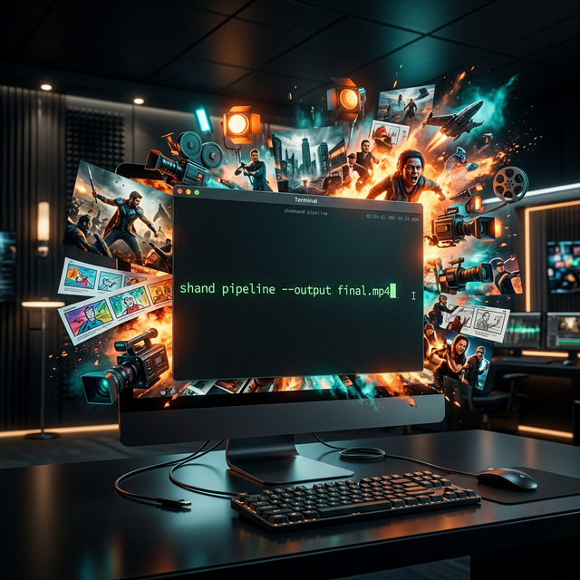

# StagentHand (`shand`)



[](https://go.dev)
[](LICENSE)

[English](./README.md)

> **CLI-first AI 短劇製作 Pipeline — 全自動、專為 Agent 設計的產線。**

---

## 管線流程

```
Story Prompt
  ↓ xAI OAuth shot plan    (LLM)
xAI Manifest
  ↓ xAI OAuth video shots  (grok-imagine-video)
Shot MP4s
  ↓ HyperFrames timeline
Timeline MP4
  ↓ FFmpeg finalization
output.mp4
```

---

## 功能特色

### 核心管線

從一句故事描述直接產出 MP4。每個階段以 JSON 從 stdin 讀取、stdout 輸出，可任意與 Unix 工具組合。

### LLM 支援

所有 provider 可熱切換，只需改 config，不需要動程式碼。優先順序：flag > 環境變數 > config 檔 > 預設值。

| 提供商 | 設定值 | 備注 |
|---|---|---|
| xAI Grok OAuth | `llm.provider: xai-oauth` | 預設；沿用 Hermes OAuth 憑證 `~/.hermes/auth.json`；不需要 `XAI_API_KEY` |
| 本地 / 自架（Qwen3、vLLM、LM Studio） | `llm.provider: openai` | 設定 `base_url` 指向端點 |
| OpenAI | `llm.provider: openai` | 設定 `api_key` |
| Google Gemini | `llm.provider: gemini` | 設定 `api_key` |
| Anthropic Claude | `llm.provider: anthropic` | 設定 `api_key` 或 `ANTHROPIC_API_KEY` |
| AWS Bedrock (Nova、Claude) | `llm.provider: bedrock` | 使用共用 `aws:` 憑證 |

### 圖像生成

預設 xAI OAuth video pipeline 會跳過靜態圖像生成。Remotion / Nova / 舊流程仍可透過 `image.provider` 熱切換；回傳格式（PNG / JPEG / WebP）由 magic bytes 自動偵測。

獨立 xAI-native pipeline 重寫規劃記錄在 [`docs/xai-native-pipeline-plan.md`](docs/xai-native-pipeline-plan.md)。

| 提供商 | 設定值 | 備注 |
|---|---|---|
| aiark (Qwen2.5-VL) | `image.provider: aiark` | 自架；設定 `image.base_url` |
| Nano Banana 2 | `image.provider: nanobanana` | 基於 Gemini；支援角色參考圖 |
| AWS Nova Canvas | `image.provider: bedrock` + `image.model: amazon.nova-canvas-*` | 使用共用 `aws:` 憑證 |
| AWS Titan | `image.provider: bedrock` + `image.model: amazon.titan-image-generator-*` | 使用共用 `aws:` 憑證 |
| Stability AI | `image.provider: stability` | 透過 Bedrock；使用共用 `aws:` 憑證 |

### 語音合成

預設 xAI OAuth video pipeline 會跳過 TTS。Remotion / rough-cut 流程仍可透過 `audio.voice_provider` 熱切換。

| 提供商 | 設定值 | 備注 |
|---|---|---|
| Amazon Polly Neural | `voice_provider: polly` | 多語言、SSML |
| aiark TTS (Qwen3-TTS) | `voice_provider: aiark` | 自架；設定 `aiark_tts_base_url` |

多語者模式（`--multi-speaker`）根據角色登錄為每條 `DialogueLine` 路由不同聲線。

### 背景音樂

預設 xAI OAuth video pipeline 會跳過 BGM。Remotion / rough-cut 流程仍可透過 `audio.music_provider` 熱切換。

| 提供商 | 設定值 |
|---|---|
| Jamendo | `music_provider: jamendo` |
| aiark Music (ACE-Step) | `music_provider: aiark` |

### AI 評審

使用多模態 LLM 評審渲染後的 MP4。評審 provider 透過 `critic.provider` 獨立設定，與生成 LLM 解耦。4 個維度評分，強制閾值：視覺 ≥ 8、音視頻同步 ≥ 8、總分 ≥ 32/40。

| 提供商 | 設定值 |
|---|---|
| AWS Bedrock Nova Pro | `critic.provider: bedrock`（預設） |

| 維度 | 說明 |
|---|---|
| 視覺一致性 (A) | 角色一致性、字幕清晰度 |
| 音視頻同步 (B) | BGM 閃避、語音自然度、字幕時序 |
| Directive 遵循度 (C) | BGM 情境匹配、視覺 directive 合規性 |
| 敘事基調 (D) | 節奏感、戲劇呼吸空間、故事收尾 |

### Directives 配置系統

兩個全域 directive 透過 JSON 注入：

- `style_prompt`：自動前置到每個 panel 的圖像生成 prompt，確保視覺風格統一。
- `bgm_tags`：傳給 Jamendo 控制音樂情境。

另有 per-panel `PanelDirective`，可控制鏡頭動效、轉場類型、字幕位置與字體大小。

### 多語言 TTS

Amazon Polly Neural 支援多語言。使用 `--language` 選擇語音語系，預設 `zh-TW`。

| 語言代碼 | 語系 |
|---|---|
| `zh-TW` | 繁體中文（台灣）— 預設 |
| `cmn-CN` | 簡體中文（大陸） |
| `en-US` | 英文（美國） |
| `en-GB` | 英文（英國） |
| `ja-JP` | 日文 |
| `ko-KR` | 韓文 |

### AI 評審自動重試

設定 `--max-retries N` 後，REJECT 結果會自動觸發最多 N 次重試循環，並根據低分維度選擇策略：

| 條件 | 行動 |
|---|---|
| `visual_score < 8` | 強化 StylePrompt 並重新生成所有圖片 |
| `audio_sync_score < 8` | 降低 DuckingDepth 0.1，只重渲染 |
| `tone_score < 6` | 將所有 panel 時長乘以 1.2，只重渲染 |

### 角色一致性（Character Registry）

角色參考圖永久儲存於 `~/.shand/characters/<name>/ref.png`。只需注冊一次，管線在每個包含該角色的 panel 自動帶入參考圖，保持跨場景、跨集視覺一致。

```bash
# 用 image provider 生成立繪並注冊
./shand character generate 阿志 --description "男，28歲，短黑髮，黑框眼鏡，白色廚師服"

# 或從現有圖片直接匯入
./shand character register 小芸 --image ./xiaoyun_ref.png

# 列出已注冊角色
./shand character list
```

### 批量製作

使用 `--episodes N` 從同一個故事描述一次生成多集。在 xAI-native 路徑中，並發數上限由 `--batch-concurrency` 控制（預設 2），每集會寫入 batch 輸出目錄底下的 `episode_###` 子目錄。

### Agentic 後製

Phase 9.5 新增完全自動化後製循環。`postprod` 子指令評估 MP4、生成修改計劃、對 RemotionProps 打補丁並重渲染，全程無需人工干預。

後製操作分三層：

**Layer A — 需要 API：**
- `regenerate_image`：重新生成指定 panel 的圖像
- `regenerate_audio`：重新合成對白語音
- `replace_bgm`：從 Jamendo 取得新的背景音樂

**Layer B — 零成本 props 修改：**
- `patch_dialogue`：修改字幕 / 對白文字
- `patch_duration`：調整 panel 顯示時長
- `patch_panel_directive`：修改鏡頭運動、轉場等 per-panel 設定
- `patch_global_directive`：修改 StylePrompt、BGMTags 等全域設定

**Layer C — 重渲染：**
- `rerender`：從更新後的 props 重新渲染 Remotion 合成

### 導演模式鏡頭運動

LLM 為每個 panel 生成 `PanelDirective`，包含鏡頭動效（ken_burns_in / ken_burns_out / pan_left / pan_right / static）、轉場類型與字幕效果，並遵循導演規則（開場偏 ken_burns_out、高潮衝突偏 ken_burns_in + cut 等）。

### 智能恢復機制

檔案感知快取。管線中途失敗後重啟，自動跳過磁碟上已存在的 `image_url` / `audio_url` 資產。不重複呼叫 API，不浪費費用。

### 人類監控（HITL）

四個 HITL 檢查點：`outline`、`storyboard`、`images`、`final`。暫停時會在 stderr 印出 checkpoint ID 與操作指令。

```
story → [outline ⏸] → [storyboard ⏸] → [images ⏸] → [final ⏸] → mp4
```

```
⏸  HITL checkpoint [stage=outline  id=xxxx-xxxx]
   Approve : shand checkpoint approve xxxx-xxxx
   Reject  : shand checkpoint reject  xxxx-xxxx
```

| 管道 | 操作方式 |
|---|---|
| CLI | `shand checkpoint approve <id>` |
| Discord | Webhook → bot 回覆 |
| HTTP API | `POST :28080/checkpoints/:id/approve` |

### Agent 友好設計

以 AI Agent 為第一優先使用者。嚴格的輸入防護阻擋目錄穿越、雙重編碼與控制字元注入。非零 exit code 加上結構化 stderr 讓 Agent 可預測地進行 retry。

---

## 快速開始

### 環境需求

```bash
# Go 1.23+, Node.js 20+, FFmpeg, AWS CLI
brew install awscli ffmpeg node
go build -o shand .
```

### 全流程執行

```bash
echo "機器人找到了一朵會發光的花" | ./shand pipeline --skip-hitl
```

### xAI-native 生產測試流程

預設生產路徑使用 xAI OAuth 做 planning 與 video generation，再用 HyperFrames 搭配 FFmpeg 做可重現渲染。在這條路徑中，xAI 是唯一模型層；HyperFrames 是 timeline renderer；FFmpeg/ffprobe 負責正規化、靜音 finalization、preview extraction 與 validation。先透過 Hermes 完成登入：

```bash
hermes auth add xai-oauth
./shand auth xai status
```

建議明確指定輸出目錄，讓 resume 與 inspect 都可預期：

```bash
OUT=outputs/glowing-flower

echo "機器人找到了一朵會發光的花" \
  | ./shand pipeline --skip-hitl --panels 3 --output-dir "$OUT"

./shand xai inspect "$OUT" \
  | jq '{status, project_id, shots, missing_artifacts, issues, output_video: .artifacts.output_video}'

./shand xai inspect --strict "$OUT" > "$OUT/inspect.json"
./shand xai validate "$OUT" > "$OUT/validation.json"
```

同一個故事與同一個輸出目錄再次執行時，會嘗試沿用匹配的 `xai_manifest.json` 與有效 cached shots：

```bash
echo "機器人找到了一朵會發光的花" \
  | ./shand pipeline --skip-hitl --panels 3 --output-dir "$OUT"
```

只有在確定要重新花 xAI 呼叫成本時才使用 force flags：

```bash
# 重新用 xAI 規劃；未變更且有效的 shot videos 仍可重用。
echo "機器人找到了一朵會發光的花" \
  | ./shand pipeline --skip-hitl --panels 3 --output-dir "$OUT" --force-replan

# 保留匹配的 story manifest，但重新生成 xAI shot videos。
# 切換 video.model 會更新 video_model/prompt_hash，不會重新 planning。
echo "機器人找到了一朵會發光的花" \
  | ./shand pipeline --skip-hitl --panels 3 --output-dir "$OUT" --force-regenerate
```

xAI-native 預期產物包含 `xai_manifest.json`、`xai_run_metadata.json`、`shots/shot_NNN.mp4`、`normalized/shot_NNN.mp4`、`render_metadata.json`、`preview_frame.jpg` 與最終 `output_xai.mp4`。

`xai validate` 比 `xai inspect --strict` 更嚴格：它還會執行 FFmpeg/ffprobe 驗證，並要求每個 shot 都有真實生產生成留下的 xAI request/status metadata。兩個指令都可以檢查單一 xAI-native 輸出目錄，或包含 `episode_###` 的 batch root。

可用 no-network smoke 驗證 dry-run 生成路徑與 strict inspect 契約：

```bash
scripts/smoke-xai-native-dry-run.sh

# 保留 smoke 產物以便除錯。
KEEP_SMOKE_OUTPUTS=1 scripts/smoke-xai-native-dry-run.sh
```

可選 live validation gate 可以驗證既有產物，或在明確開啟時產生 fresh live output。既有產物驗證是本地檢查，不需要 Hermes auth；fresh generation 仍需要 Hermes xAI OAuth 憑證：

```bash
# 驗證既有 xAI-native 輸出目錄，不會產生新的 xAI 呼叫。
OUT_DIR=outputs/glowing-flower scripts/validate-xai-native-live.sh

# 產生 fresh live output，然後 inspect 與 validate。
RUN_XAI_LIVE_VALIDATION=1 OUT_DIR=outputs/live-check PANELS=3 scripts/validate-xai-native-live.sh

# 產生並驗證 fresh batch output。live gate 的 batch concurrency 預設是 1。
RUN_XAI_LIVE_VALIDATION=1 OUT_DIR=outputs/live-batch PANELS=1 EPISODES=2 BATCH_CONCURRENCY=1 scripts/validate-xai-native-live.sh
```

GitHub Actions 也有手動觸發的 `xAI Native Live Validation` workflow。把 `~/.hermes/auth.json` 做 base64 後存成 repository secret `HERMES_AUTH_JSON_B64`；如果 secret 不存在，workflow 會 skip，不會花 xAI 呼叫。

### 從現有 panels 恢復

```bash
cat ~/.shand/projects/my-id/remotion_props.json | ./shand pipeline --skip-hitl
```

### 只執行渲染

```bash
cat remotion_props.json | ./shand remotion-render --output ./final.mp4
```

### 執行 AI 評審

```bash
./shand critic --video ./final.mp4 --props ./remotion_props.json
```

---

## 配置

預設配置路徑：`~/.shand/config.yaml`。環境變數使用 `SHAND_` 前綴（如 `SHAND_LLM_API_KEY`）。CLI flag 優先級最高。

```yaml
# 所有 AWS 後端 provider 共用的憑證
# （Bedrock LLM、Polly TTS、Nova Canvas/Titan 圖像、Nova Reel 影片、Stability）
# 舊版 llm.aws_* 鍵仍可使用，向下相容。
aws:
  access_key_id: ""
  secret_access_key: ""
  region: us-east-1

llm:
  provider: xai-oauth        # xai-oauth | openai | gemini | anthropic | bedrock
  model: grok-4.3
  api_key: ""
  base_url: ""               # 任何 OpenAI-compatible 端點；空值 = 官方 API
  no_json_mode: false        # 不支援 response_format:json 的伺服器請設 true
  strip_think_tags: false    # 推理模型（Qwen3、QwQ）輸出 <think> 時請設 true

xai_oauth:
  model: grok-4.3
  base_url: https://api.x.ai/v1
  token_path: ~/.hermes/auth.json

image:
  provider: mock              # 預設 xAI video flow 跳過靜態圖像
  api_key: ""
  base_url: ""               # aiark 自架端點
  model: ""                  # bedrock 用：amazon.nova-canvas-* 或 amazon.titan-image-*
  width: 576
  height: 1024
  region: ""                 # 圖像專用 region 覆寫（預設使用 aws.region）

audio:
  voice_provider: mock        # 預設 xAI video flow 跳過 TTS
  music_provider: mock        # 預設 xAI video flow 跳過 BGM
  jamendo_client_id: ""
  # aiark TTS（自架 Qwen3-TTS）：
  # aiark_tts_base_url: ""
  # aiark_tts_api_key: ""
  # aiark_tts_voice: ""

critic:
  provider: bedrock           # 可選；目前支援 bedrock
  model: ""                   # 空值 = amazon.nova-pro-v1:0

video:
  provider: xai_oauth         # xai_oauth（或 xai-oauth alias）| remotion | nova_reel | grok_browser (deprecated) | hyperframes
  model: grok-imagine-video   # xai_oauth 使用
  s3_bucket: ""               # nova_reel 必填
  region: ""                  # 影片專用 region 覆寫

remotion:
  template_path: ./remotion-template
  composition: ShortDrama

notify:
  discord_webhook: ${DISCORD_WEBHOOK_URL}

store:
  db_path: ~/.shand/shand.db

server:
  port: 28080                 # HTTP API 供 agent / Discord bot 批准 checkpoint
```

---

## 指令參考

所有指令從 stdin 讀取 JSON，輸出到 stdout（另有說明除外）。所有指令支援 `--dry-run` 驗證，不呼叫外部 API。

| 指令 | 說明 |
|---|---|
| `shand pipeline` | 全流程：故事 → mp4 |
| `shand story-to-outline` | 故事描述 → 大綱 JSON |
| `shand outline-to-storyboard` | 大綱 → 分鏡腳本 |
| `shand storyboard-to-panels` | 分鏡腳本 → 畫格列表 |
| `shand panel-to-image` | 生成單一畫格圖像 |
| `shand panels-to-images` | 批量並發圖像生成 |
| `shand storyboard-to-remotion-props` | 畫格列表 → Remotion 配置 |
| `shand remotion-render` | 渲染 MP4 |
| `shand remotion-preview` | 開啟 Remotion Studio 預覽 |
| `shand critic` | AI 多模態視頻品質評審 |
| `shand checkpoint list` | 列出所有 HITL 檢查點 |
| `shand checkpoint approve <id>` | 批准檢查點 |
| `shand checkpoint reject <id>` | 拒絕檢查點 |
| `shand checkpoint wait <id>` | 輪詢直到檢查點完成 |
| `shand status <job-id>` | 查詢任務狀態 |
| `shand xai inspect <output-dir>` | 以 JSON 摘要 xAI-native 產物 |
| `shand xai validate <output-dir>` | 用 inspect、ffprobe、request metadata 驗證 xAI-native 生產輸出 |
| `shand character list` | 列出所有已注冊角色 |
| `shand character show <name>` | 顯示角色參考圖資訊 |
| `shand character generate <name>` | 生成並注冊角色立繪 |
| `shand character register <name>` | 從現有圖片注冊角色 |
| `shand postprod evaluate` | AI 評審渲染後的 MP4 |
| `shand postprod apply` | 套用 EditPlan 到 RemotionProps |
| `shand postprod rerender` | 從更新後的 props 重渲染 |
| `shand postprod loop` | 自動評估→修正→重渲染循環 |

### 常用 flags

| Flag | 適用指令 | 效果 |
|---|---|---|
| `--dry-run` | 所有指令 | 跳過外部 API 呼叫，回傳模擬 JSON |
| `--skip-hitl` | `pipeline` | 停用全部 4 個 HITL 暫停點 |
| `--output-dir <path>` | `pipeline` | xAI-native 輸出目錄；使用同一路徑可 resume |
| `--output <path>` | `remotion-render` | 輸出 MP4 路徑 |
| `--video <path>` | `critic` | 渲染後 MP4 的路徑 |
| `--props <path>` | `critic` | `remotion_props.json` 的路徑 |
| `--config <path>` | 所有指令 | 覆寫預設 config 檔路徑 |
| `--language` | `pipeline` | TTS 語言代碼（預設 zh-TW） |
| `--max-retries` | `pipeline` | AI 評審自動重試次數（預設 0） |
| `--episodes N` | `pipeline` | xAI-native batch；每集寫入 `episode_###` 子目錄 |
| `--batch-concurrency` | `pipeline` | 最大並發集數（預設 2） |
| `--max-iterations` | `postprod loop` | 後製循環最大次數（預設 3） |
| `--faithful` | `pipeline` | LLM 僅拆分原文，不進行創作 |
| `--verbatim` | `pipeline` | 單次 LLM：逐字切割，跳過 outline/storyboard |
| `--narration` | `pipeline` | 單次 LLM：改寫為旁白語氣，所有 speaker 設為空值 |
| `--multi-speaker` | `pipeline` | 依角色 Registry 路由不同聲線 |
| `--format portrait` | `pipeline` | 垂直 9:16 影片（TikTok / Reels / Shorts）；預設 |
| `--panels N` | `pipeline` | xAI-native 會將 N 個 panels 一對一映射為 N 支 xAI video shots |
| `--force-replan` | `pipeline` | xAI-native：忽略匹配 manifest，重新呼叫 xAI planning |
| `--force-regenerate` | `pipeline` | xAI-native：即使 cached shots 有效也重新生成 shot videos |
| `--video-backend` | `pipeline` | 影片渲染後端：xai_oauth / xai-oauth \| remotion \| nova_reel \| grok_browser (deprecated) \| hyperframes |
| `--skip-llm` | `pipeline` | 舊版 `remotion_props.json` 重用；`xai_oauth` 會拒絕，xAI-native resume 請使用同一個 `--output-dir` |
| `--image-dir`, `--i2v` | `pipeline` | 舊版 asset/I2V 輸入；`xai_oauth` 會拒絕，需明確指定非 xAI legacy backend |
| `--strict` | `xai inspect` | 除非 xAI-native 輸出完整，否則 exit non-zero |

---

## 架構設計

基於 SOLID 原則的分層架構。`cmd/` 層只負責 IO，不含業務邏輯。所有外部服務均透過 interface 存取，在建構時注入。

```
cmd/                   Thin layer: IO + dependency injection
internal/
  domain/              Pure data structs, zero external dependencies
  llm/                 Client interface + factory（openai-compat / bedrock / anthropic / xai-oauth / mock）
                       VideoCriticClient interface + NewVideoCriticClient factory
  image/               Client interface + factory（aiark / nanobanana / bedrock / stability / mock）
  audio/               Client interface + factory（polly / aiark-tts / mock）
                       MusicClient interface + factory（jamendo / aiark-music / mock）
                       MultiSpeakerClient interface + factory
  video/               Critic（多模態評審，透過 llm.VideoCriticClient）
  store/               Repository pattern: JobRepo + CheckpointRepo (SQLite/gorm)
  notify/              Notifier interface + Discord webhook
  remotion/            RemotionExecutor interface + exec npx remotion
  character/           角色 Registry：儲存參考圖，確保跨鏡頭一致性
  postprod/            Agentic 後製：planner、applier、自動循環
  pipeline/            Orchestrator — 僅依賴 interface，從不依賴具體 provider
config/                viper loader: flag > env > yaml > defaults
                       aws:    所有 AWS 後端 provider 共用憑證
                       critic: 影片評審獨立模型設定
remotion-template/     React + Remotion (ShortDrama composition)
```

### Provider 熱切換

切換任何 provider 只需修改 config，無需改程式碼：

```yaml
# 從本地 Qwen3 切換到 Anthropic：
llm:
  provider: anthropic
  api_key: sk-ant-...

# 從 Nano Banana 切換到 aiark 圖像：
image:
  provider: aiark
  base_url: http://aiark.internal:8080

# 從 Polly 切換到 aiark TTS：
audio:
  voice_provider: aiark
  aiark_tts_base_url: http://aiark.internal:7860

# 評審模型與生成模型各自獨立設定：
critic:
  provider: bedrock
  model: amazon.nova-pro-v1:0
```

### SOLID 原則對照

| 原則 | 實作方式 |
|---|---|
| 單一職責 | 每個套件只負責一個領域 |
| 開放封閉 | 新提供商 = 實作 interface + 新增 factory case，不動其他程式碼 |
| 里氏替換 | 每個 Mock 都是即插即用的替換，行為契約相同 |
| 介面隔離 | `LLMClient`、`VideoCriticClient`、`ImageClient`、`AudioBatcher`、`MusicBatcher` 各自獨立 |
| 依賴反轉 | `cmd/` 依賴 interface；具體型別透過建構子注入 |

---

## 給 AI Agent 的使用指引

`shand` 設計為可由 AI Agent 在無人工干預的情況下完全控制。

```bash
# 全自動執行 — Agent 全權控制
echo "太空飛行員愛上了外星植物學家" | ./shand pipeline --skip-hitl

# Agent 透過 HTTP 批准 HITL 檢查點
curl -X POST http://localhost:28080/checkpoints/<id>/approve

# Agent 讀取結構化 exit code
./shand pipeline --skip-hitl
echo $?   # 0=success, 1=failed, 2=waiting_hitl

# Agent 獨立串接各階段
echo "story text" \
  | ./shand story-to-outline \
  | ./shand outline-to-storyboard \
  | ./shand storyboard-to-panels \
  | ./shand panels-to-images \
  | ./shand storyboard-to-remotion-props \
  | ./shand remotion-render --output ./out.mp4
```

**輸入防護：**

所有使用者提供的字串（ID、路徑、prompt）在使用前都會通過 `internal/domain` 的淨化邏輯。管線會拒絕目錄穿越序列、雙重編碼字元和控制字元。Agent 被視為不可信來源。

---

## 開發狀態

| 階段 | 狀態 | 交付內容 |
|---|---|---|
| Phase 1 | 完成 | CLI 骨架、viper 配置、domain 型別、SQLite/gorm、status/checkpoint |
| Phase 2 | 完成 | LLM interface、story-to-outline / outline-to-storyboard / storyboard-to-panels |
| Phase 3 | 完成 | Image interface、panel-to-image / panels-to-images、Discord 通知 |
| Phase 4 | 完成 | Remotion 模板、storyboard-to-remotion-props、render/preview |
| Phase 5 | 完成 | Pipeline 協調器、4 節點 HITL、端對端測試 |
| Phase 6 | 完成 | AWS Bedrock LLM/Image、Amazon Polly Neural TTS + SSML、音頻同步 |
| Phase 7 | 完成 | AI 評審（多模態）、Jamendo BGM、字幕淨化、動態時長 |
| Phase 8 | 完成 | Directives 系統（StylePrompt / BGMTags）、智能恢復 |
| Phase 9 | 完成 | 多語言 TTS、AI 評審自動重試、角色 Registry、批量製作 |
| Phase 9.5 | 完成 | Agentic 後製（postprod evaluate/apply/rerender/loop） |
| HITL 修補 | 完成 | 補齊 outline/storyboard/final 三個缺失 checkpoint，stderr 通知 |
| 角色整合 | 完成 | character generate/register + pipeline 自動 registry lookup |
| Phase 10a | 完成 | 多角色 TTS + 角色語音路由 |
| Phase 10b | 完成 | 垂直影片 9:16 格式支援 |
| Phase 10c | 完成 | 系列連續性（滑動視窗記憶） |
| Phase 10.0 | 完成 | 結構化 `DialogueLine`（多角色 TTS 前置） |
| Phase 10.1 | 完成 | 字幕直接修補 + LLM 翻譯（`--language`） |
| Refactor | 完成 | Provider 解耦：共用 `aws:` 設定、`NewVideoCriticClient` factory、圖像多格式偵測、移除 llm factory 反向 import |

---

## 授權 / 致謝

MIT 授權。詳見 [LICENSE](LICENSE)。

由 **Castle Studio** 開發。採用雙模型工作流：Claude（施工）+ Codex（審核）。

---

*StagentHand — Part of the Castle Studio C3A ecosystem.*
*Binary: `shand` | Module: `github.com/baochen10luo/stagenthand`*
